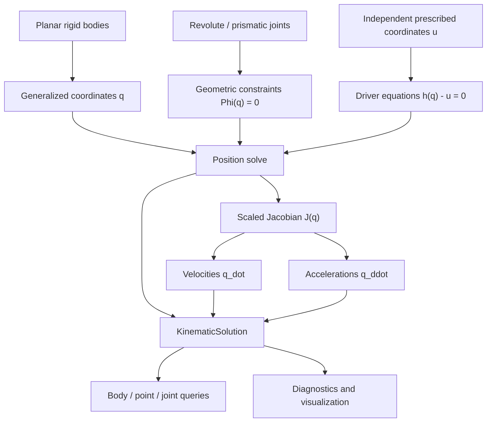
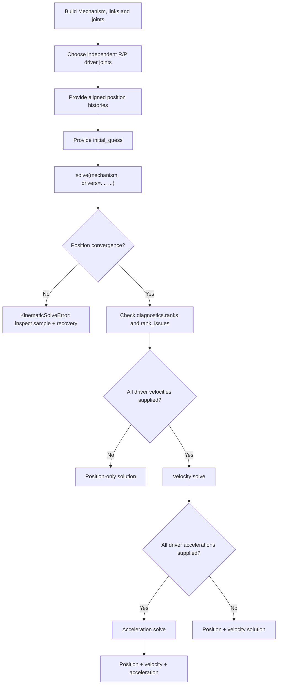

# From kinematic theory to Kimech

This guide connects the equations for a planar constrained mechanism with
Kimech's public API. It applies to a single independent input and to fully
prescribed Multi-DOF mechanisms in the **unreleased 0.7.0 branch**.

## Concept map

The diagram is Mermaid source, viewable in GitHub/compatible Markdown viewers:



The model is declarative: `Mechanism` defines bodies, points and constraints,
while `KinematicDriver` stores prescribed input histories. Neither is a motor
or a dynamic actuator. The solver returns state snapshots rather than modifying
the mechanism's geometry.

## Workflow



Each position sample is solved in the order supplied. The predictor follows the
segment between successive vectors of prescribed joint coordinates; warm start
and adaptive subdivision provide recovery. Physical `time=` is optional and
does **not** cause numerical integration or differentiation.

## Theory ↔ API

| Kinematic concept | Mathematical object | Kimech API |
|---|---|---|
| Generalized body coordinates | `q = (x₁, y₁, θ₁, …)` | `solution.coordinates` |
| Geometric constraints | `Phi_c(q) = 0` | `mechanism.revolute(...)`, `mechanism.prismatic(...)` |
| Independent prescribed inputs | `h(q) - u = 0` | `KinematicDriver(joint, position=...)` |
| Position solve | `[Phi_c; h - u] = 0` | `solve(mechanism, drivers=..., initial_guess=...)` |
| Velocity equations | `J(q) q_dot = [0; u_dot]` | `KinematicDriver(..., velocity=...)` and `solution.coordinate_velocities` |
| Acceleration equations | `J(q) q_ddot = [-gamma_c; u_ddot - gamma_d]` | `KinematicDriver(..., acceleration=...)` and `solution.coordinate_accelerations` |
| Point motion | `r_P, v_P, a_P` | `point_positions(P)`, `point_velocities(P)`, `point_accelerations(P)` |
| Joint motion | `u_j, u_dot_j, u_ddot_j` | `joint_coordinates(j)`, `joint_velocities(j)`, `joint_accelerations(j)` |
| Local independence | `rank(J_c)`, `rank(J)` | `solution.diagnostics.joint_ranks`, `.ranks`, `.rank_issues` |

Kimech uses a scaled (dimensionless) Jacobian to solve and diagnose the
constraints. Numerical rank classification is local to the evaluated
configuration; equation counting alone cannot establish independence.

## Minimal API cheat sheet

```python
from kimech import Mechanism, KinematicDriver, solve
from kimech.visualization import plot, animate

mechanism = Mechanism("my_mechanism")
# Define ground points, mobile links/points and R/P joints.

first = KinematicDriver(joint1, position=theta1, velocity=omega1,
                        acceleration=alpha1)
second = KinematicDriver(joint2, position=theta2, velocity=omega2,
                         acceleration=alpha2)

result = solve(
    mechanism,
    drivers=[first, second],   # For 1-DOF, drivers=first also works.
    initial_guess=initial_guess,
    time=time,                 # Optional physical sample times.
)
config = result[0]            # Single configuration at the first sample.
subset = result[1:]           # Sliced state/driver/diagnostic histories.

q = result.coordinates
q_dot = result.coordinate_velocities
q_ddot = result.coordinate_accelerations
point_path = result.point_positions(point_p)
point_speed = result.point_velocities(point_p)
point_accel = result.point_accelerations(point_p)
issues = result.diagnostics.rank_issues

fig, ax = plot(config)
motion = animate(result)
```

The snippet assumes that `joint1`, `joint2`, `point_p`, the input arrays,
`time`, and `initial_guess` have already been defined in the mechanism. For a
**complete, executable 2R example**, see
[`examples/serial_two_revolute.py`](../../examples/serial_two_revolute.py).

A required invariant for the current solver is

```text
2 × number_of_joints + number_of_drivers == 3 × number_of_mobile_links
```

All drivers must refer to distinct joint objects in the mechanism and share
the same number of position samples. To request generalized velocity or
acceleration, every driver must prescribe that differential order (and
acceleration requires velocity). Mixed R/P drivers are supported.

## Singularities and interpretation

- `regular`: the selected input set locally determines the state.
- `joint_rank_loss`: the geometric joint equations are locally dependent.
- `dependent_drivers`: the joint constraints are independent, but the
  selected driver set does not determine every remaining motion.

A feasible position is still useful when the Jacobian is singular; Kimech
retains that position but rejects nonunique differential states. A failed
nonlinear correction alone does not prove a mechanism singularity.

See [Core concepts](concepts.md), [Time-aware kinematics](time-aware-kinematics.md)
and [Examples](examples.md) for more background. `driver_sensitivity()` is
currently restricted to **one** prescribed driver; it is not the same thing as
time differentiation.
